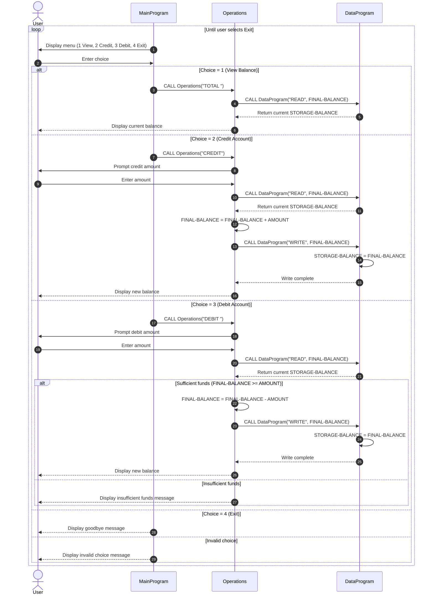

# COBOL Student Account System Documentation

## Overview
This document explains the purpose of each COBOL source file in the student account system, the key functions implemented, and business rules that govern account behavior.

The system is composed of three programs:
- `MainProgram` (`src/cobol/main.cob`)
- `Operations` (`src/cobol/operations.cob`)
- `DataProgram` (`src/cobol/data.cob`)

Together, they provide a simple menu-driven workflow for viewing balances, crediting funds, and debiting funds from a student account.

## File Purposes and Key Functions

### 1. `src/cobol/main.cob` (`PROGRAM-ID. MainProgram`)
Purpose:
- User interaction and menu control.
- Acts as the entry point of the application.

Key functions:
- Displays a looped menu with these options:
  - `1` View Balance
  - `2` Credit Account
  - `3` Debit Account
  - `4` Exit
- Reads user choice into `USER-CHOICE`.
- Routes user requests by calling `Operations` with operation codes:
  - `TOTAL ` for balance inquiry
  - `CREDIT` for account credit
  - `DEBIT ` for account debit
- Stops looping only when user selects `4`.

### 2. `src/cobol/operations.cob` (`PROGRAM-ID. Operations`)
Purpose:
- Business operation handler for account actions.
- Applies credit/debit logic and coordinates reads/writes with data storage.

Key functions:
- Accepts an operation code from `MainProgram`.
- For `TOTAL `:
  - Calls `DataProgram` with `READ` to retrieve current balance.
  - Displays current balance.
- For `CREDIT`:
  - Prompts for an amount.
  - Reads current balance from `DataProgram`.
  - Adds amount to balance.
  - Writes updated balance back via `DataProgram` with `WRITE`.
- For `DEBIT `:
  - Prompts for an amount.
  - Reads current balance.
  - Checks if balance is sufficient.
  - If sufficient, subtracts and writes new balance.
  - If insufficient, shows error message and does not update balance.

### 3. `src/cobol/data.cob` (`PROGRAM-ID. DataProgram`)
Purpose:
- In-memory balance storage service.
- Encapsulates account balance state and exposes read/write operations.

Key functions:
- Maintains `STORAGE-BALANCE` as the current account balance.
- Accepts operation mode and balance through linkage parameters.
- For `READ`:
  - Copies `STORAGE-BALANCE` to caller-provided `BALANCE`.
- For `WRITE`:
  - Copies caller-provided `BALANCE` to `STORAGE-BALANCE`.

## Student Account Business Rules

Based on current implementation, student account behavior follows these rules:

1. Single account model:
- The program manages one active student account balance in memory.
- There is no account ID, student record lookup, or multi-account support.

2. Opening/default balance:
- Initial balance is `1000.00`.

3. Balance inquiry:
- A user can view the current balance via menu option `1`.

4. Credit behavior:
- Crediting increases balance by the entered amount.
- Updated balance is persisted in program memory for later operations.

5. Debit behavior (no overdraft):
- Debit is allowed only when `current balance >= requested debit amount`.
- If funds are insufficient, debit is rejected and balance remains unchanged.

6. Data persistence scope:
- Balance is stored in working storage (`STORAGE-BALANCE`) and is retained only while the program process is running.
- No database/file persistence exists; restarting the program resets to default.

7. Numeric format:
- Monetary values are stored as `PIC 9(6)V99` (up to six integer digits plus two decimals).

8. Input validation limits:
- Menu input handles invalid choices with a message.
- Amount entry does not currently enforce explicit validation for negative/non-numeric values in code.

## High-Level Runtime Flow
1. `MainProgram` shows menu and receives choice.
2. `MainProgram` calls `Operations` with the selected operation code.
3. `Operations` calls `DataProgram` (`READ`/`WRITE`) as needed.
4. Result is displayed to the user.
5. Loop continues until user exits.

## Sequence Diagram (Data Flow)

